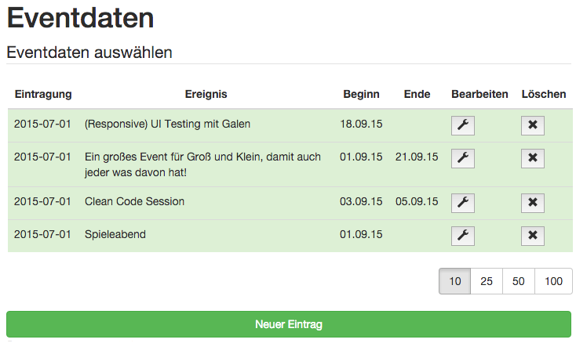

# Angular Spring Demo Application 
[](https://travis-ci.org/hypery2k/angular-spring-boot-sample)

## Development-Setup

### Setup

* Install JDK 8+ and Maven 3.3+
* Install MySQL5.5+ Server
* Install NodeJS and npm (http://nodejs.org/download/)
* Install Build Tools
```bash
$ sudo npm install -g bower grunt-cli karma
```
* Install [docker](http://docs.docker.com) (optional)


#### local setup

Install MySQL and run the following SQL:
```
CREATE USER 'ngspring'@'localhost' IDENTIFIED BY 'password';
GRANT ALL PRIVILEGES ON * . * TO 'ngspring'@'localhost';
CREATE DATABASE NGSPRING;
```

Run maven

```bash
$ mvn clean install idea:idea eclipse:eclipse
```

Projects can now imported in your favourite IDE

### Development


1. start the backend:

```bash
$ vagrant up
$ cd angular-spring-boot-webapp
$ mvn spring-boot:run
```

2. start the frontend:

```bash
$ cd angular-spring-boot-webapp
$ npm start
```

Browser now opens [localhost:9000](http://localhost:9000) and you can add some events ;)



>Note: 
Any changes in the frontend will be lead to a reload in the browser

Backend is available at [](http://localhost:9080) with user/password

API is available at [](http://localhost:9080/swagger-ui.html)

### Docker

#### Run

```bash
$ mvn -Pdocker spring-boot:run
```